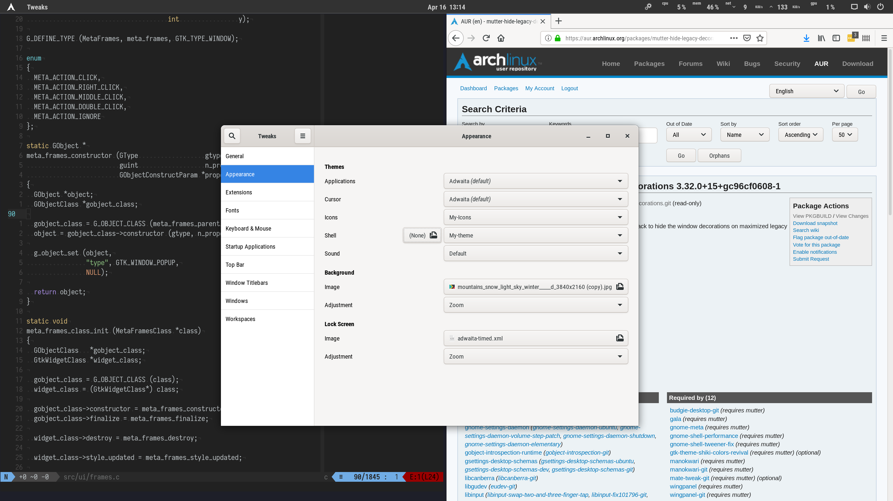
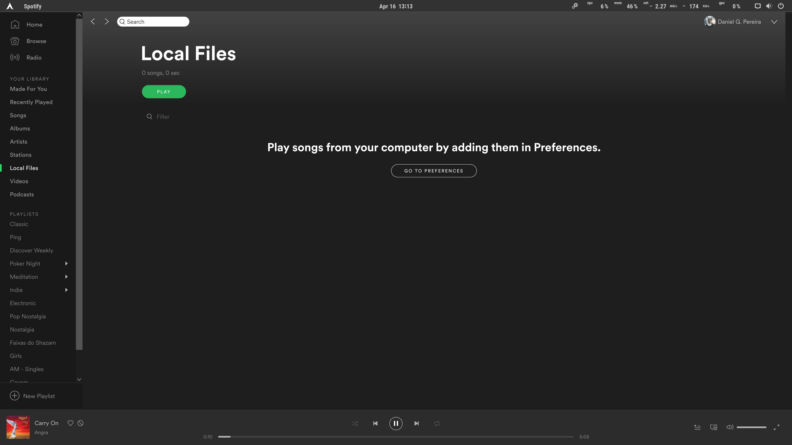

# Stil GNOME Theme

This is basically the default GNOME Adwaita theme, with some small tweaks to
make it more pleasant to me.

## Features

This is not a complete theme, it does not include GTK styles and it aims to
change small stuff on the original GNOME theme to make it more pleasant to my
own needs. It's meant to be used with [this
modified](https://aur.archlinux.org/packages/mutter-hide-legacy-decorations/)
version of Mutter so we get to hide the decorations on maximized windows. Also,
some small tweaks such as font settings should be done in order to have a
consistent experience.

#### How it looks

Side-by-side Tiled windows   |  Spotify                      | Overview
:---------------------------:|:-----------------------------:|:----------------------------:
     |     | 

### Shell

* Uses a font that I use across my entire UI (Roboto Condensed) and I like much
  better than Cantarell;
* Application icons and down arrows are removed from the top bar, and it's
  cleaner;
* Makes the top bar gray so it fits best my working environment which is mostly
  terminal-based;
* Remove the small round edge on the top bar;
* The overview screen is also slightly changed, and I've removed the background
  of the dash menu on the left side.

### Icons

The icon pack is a stripped version of [Flat
Remix](https://github.com/daniruiz/flat-remix) yellow variant. I find it a
little more pleasant than the original Adwaita set.

### Name

[Naming is hard.](https://martinfowler.com/bliki/TwoHardThings.html) So I named
this as an acronym for _"Small Tweaks I Like"_.

## License

The work on the theme and most of the content on this repository is licensed
under the [BSD 3-Clause](LICENSE). The icon pack is provided by [Flat
Remix](https://github.com/daniruiz/flat-remix) and is licensed under the
[GPLv3](icons/LICENSE) license.
